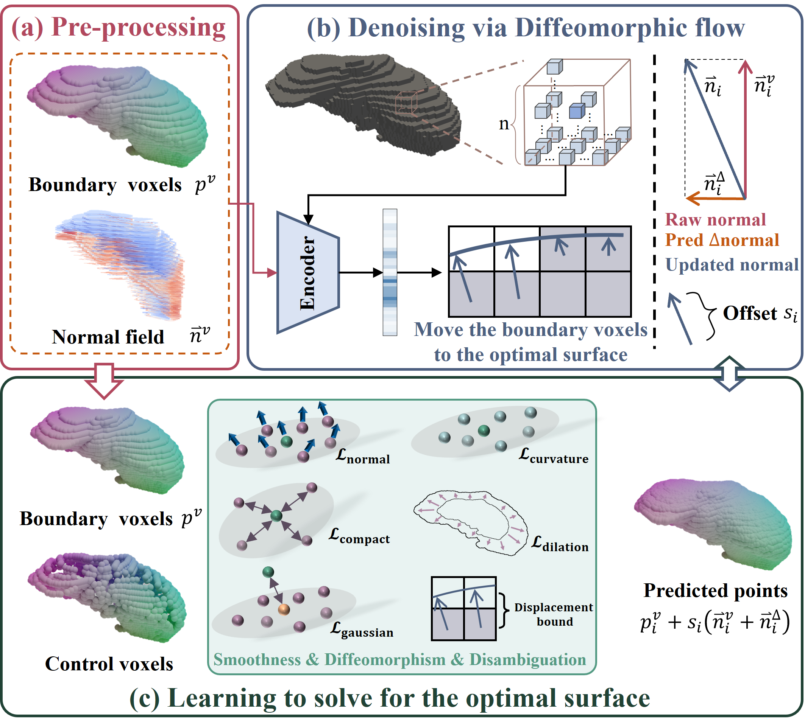

# SSAD: Prior-driven self-supervised staircase artifact denoising via diffeomorphic flow for volumetric medical image surface reconstruction

<p align="center">
  
  <br/>
  <em>Overview of the SSAD.</em>
</p>

## Installation

We provide an `environment.yaml` file that contains all required dependencies with pinned versions.

```bash
conda env create -f env.yaml
conda activate ssad
```

This will install Python 3.9, PyTorch 2.4.1, PyTorch3D 0.7.8, and all other necessary packages.

## Datasets
The datasets used in this paper are publicly available at the following links:

- **CHAOS Dataset** [https://chaos.grand-challenge.org]

- **WORD Dataset** [https://github.com/HiLab-git/WORD]

- **MMWHS Dataset** [https://zmiclab.github.io/zxh/0/mmwhs/]

- **TotalSegmentator Dataset** [https://github.com/wasserth/TotalSegmentator]


## Data Preprocessing 

```bash
python ./src/dataset.py
```

## Training

```bash
python train.py
```

## Testing

```bash
python test.py
```

## Citation

If you find this work useful for your research, please cite our paper:

```bibtex
@article{SHI2027104300,
title = {SSAD: Prior-driven self-supervised staircase artifact denoising via diffeomorphic flow for volumetric medical image surface reconstruction},
journal = {Medical Image Analysis},
volume = {115},
pages = {104300},
year = {2027},
issn = {1361-8415},
doi = {https://doi.org/10.1016/j.media.2026.104300},
url = {https://www.sciencedirect.com/science/article/pii/S1361841526003695},
author = {Jing Shi and Zhanhua Zhang and Yuan Xing and Jisi Tang and Xiangyun Ren and Fei Wang and Rong Liu},
}
```


